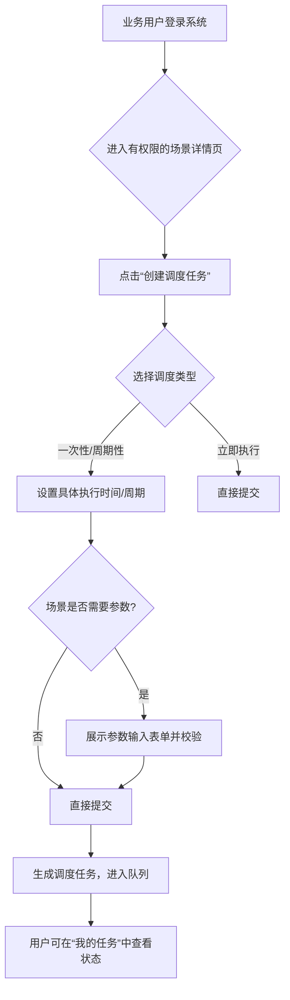

# 产品需求文档

---

## 1. 文档基本信息

| 项目 | 内容 |
|------|------|
| 产品名称 | RPA流程自动化平台 |
| 功能模块 | 自服务任务调度与监控中心 |
| PRD 版本 | v1.0 |
| 作者 | [请在此处填写]（产品经理） |
| 评审人 | [请在此处填写]（Tech Lead）、[请在此处填写]（UX）、[请在此处填写]（Data） |
| 创建日期 | [请在此处填写] |
| 预计上线时间 | [请在此处填写] |

---

## 2. 背景与目标（Why）

### 2.1 业务背景
- **当前用户痛点**：
    1.  **效率低下**：任务调度依赖IT管理员手动操作，请求响应慢，成为业务瓶颈。
    2.  **灵活性差**：用户无法自主定义任务执行时间（如自定义定时），无法满足业务周期性需求。
    3.  **体验不佳**：用户输入缺乏引导与校验，易出错；流程执行缺乏可视化的过程日志，问题定位困难。
    4.  **结果不直观**：现有结果查看以技术日志为主，业务用户难以直接获取和理解业务成果（如报表文件）。
- **市场机会**：领先的RPA平台均提供用户自服务与精细化权限控制，以提升运营效率与用户体验。
- **战略对齐**：支持公司“提升业务部门自助数字化能力”与“降本增效”的战略目标。

### 2.2 产品目标
- **核心目标**：为业务用户提供安全、灵活、透明的RPA任务自服务调度与结果查看能力，解放IT生产力，加速业务流程闭环。
- **成功指标（OKR）**：
    - ✅ **用户自服务调度占比** ≥ 60%（上线后3个月）
    - ✅ **平均任务从申请到执行的周期** 从 [请在此处填写] 小时缩短至 ≤ 2 小时
    - ❌ **因用户输入错误导致的流程执行失败率** < 5%

---

## 3. 目标用户（Who）

| 用户类型 | 特征 | 核心诉求与使用场景 |
|--------|------|-------------------|
| 财务系统管理员 | 拥有最高配置权限，关注安全与合规 | 1. 通过RBAC模型为不同业务用户分配场景权限。 2. 监控所有场景组的执行状态与系统负载。 |
| 财务业务用户（如专员、分析师） | 熟悉自身业务，需要自动化处理重复性工作 | 1. 为自己有权限的“应收账款报表”场景设置每月5日上午9点的定时任务。 2. 任务执行后，直接查看并下载生成的报表文件。 |
| IT运维人员 | 保障系统稳定运行 | 1. 查看详细的执行过程日志，用于排查故障。 2. 接收系统级异常告警。 |

---

## 4. 功能需求（What）

### 4.1 功能列表（按优先级排序）

| 功能点 | 优先级（P0/P1/P2） | 说明 |
|-------|------------------|------|
| RBAC权限管理基础框架 | P0 | 支持角色定义、用户-角色-场景权限的分配与管理。 |
| 自服务定时任务调度 | P0 | 用户可为有权限的场景设置一次性、周期性（日/周/月/自定义Cron）调度策略。 |
| 场景组可视化编排 | P1 | 通过拖拽方式将多个场景组合成流程，设置执行顺序与简单依赖关系。 |
| 任务执行结果详情页 | P0 | 展示任务状态、时间、详细过程日志（步骤级）。 |
| 业务结果展示模块 | P1 | 结构化展示机器人产出的业务成果，如文件链接、关键数据指标。 |
| 带校验的用户参数输入表单 | P1 | 根据场景定义，动态生成输入表单，并提供前端与后端校验。 |
| 执行历史与结果导出 | P2 | 支持按时间、状态筛选历史任务，并导出结果列表或日志。 |

### 4.2 用户故事（User Stories）

> 格式：作为一个 [用户角色]，我希望 [功能]，以便 [价值]。

1.  **作为一个财务专员**，我希望能为“应收账款汇总报表”场景设置每月5日上午9点自动执行，并能在执行成功后直接下载报表文件，以便我准时完成月度报告，而无需等待IT同事协助或手动执行。
2.  **作为一个财务系统管理员**，我希望能通过一个中心化的界面，为不同的财务同事分配他们各自负责业务的场景调度权限，以便实现权责清晰的安全管理，避免越权操作。

### 4.3 详细功能描述（可配合原型图）

#### 功能：自服务定时任务调度
- **触发条件**：用户进入有权限的“场景详情”页，点击“创建调度任务”。
- **核心逻辑**：
    1.  用户选择调度类型：立即执行、一次性定时、周期性定时（支持Cron表达式）。
    2.  若场景需要输入参数，则弹出带校验的表单（如日期格式、数值范围）。
    3.  用户确认后，任务进入调度队列，用户可在“我的任务”列表查看。
- **默认策略**：新创建的任务默认处于“激活”状态。支持启用/禁用操作。
- **权限控制**：仅对拥有该场景“调度”权限的用户显示此功能入口。
- **流程逻辑图**：

> 🖼️ **原型链接**：[Figma 链接] 或 插入截图

#### 功能：任务执行结果详情页（两层结果查看）
- **触发条件**：用户在“任务列表”或收到通知后，点击某个任务的“查看详情”。
- **功能描述**：
    1.  **任务层结果**：清晰展示任务状态（成功/失败/执行中）、开始/结束时间、总耗时。
    2.  **过程日志**：以时间线或可展开的步骤形式，展示机器人执行的详细日志，包括关键操作、数据快照（脱敏）和错误信息。
    3.  **业务层结果**：在页面显著区域，展示该任务产出的业务成果。例如：“生成报表文件：[下载链接]”、“成功处理票据数量：150张”。
- **权限控制**：用户只能查看自己有权限的场景所对应的任务结果。

---

## 5. 非功能性需求

| 类型 | 要求 |
|------|------|
| 性能 | 调度任务创建响应时间 ≤ 1秒；任务列表加载时间 ≤ 2秒。 |
| 可靠性 | 调度引擎需保证99.9%的定时触发准确率；任务状态更新延迟 ≤ 30秒。 |
| 安全性 | 严格遵循RBAC，前端与后端均需进行权限校验。用户输入参数必须经过防注入处理。 |
| 可用性 | 界面需对非技术用户友好，专业术语有解释提示。任务失败必须有明确通知（站内信或邮件）。 |
| 可观测性 | 所有调度操作、任务状态变更、权限修改均需记录审计日志。 |

---

## 6. 数据需求（与数据分析师协同）

### 6.1 埋点设计
| 事件名 | 触发时机 | 属性 |
|-------|--------|------|
| `self_service_schedule_created` | 用户通过自服务界面成功创建调度任务时 | user_id, user_role, scene_id, schedule_type, has_parameters |
| `task_execution_completed` | 任一任务执行完成（无论成功失败）时 | task_id, execution_id, scene_id, status, duration, error_type (if failed) |
| `business_result_viewed` | 用户点击查看或下载任务详情页中的业务结果时 | task_id, user_id, result_type (file/metric) |
| `scene_permission_assigned` | 管理员为用户分配或修改场景权限时 | admin_id, target_user_id, scene_id, permission_type (schedule/view) |

### 6.2 核心指标
- **用户自服务调度占比** = 通过自服务功能创建的调度任务数 / 总调度任务数
- **任务平均执行成功率** = 状态为成功的任务执行数 / 总完成的任务执行数
- **业务结果查看率** = 查看了业务结果的任务数 / 状态为成功的任务数
- **用户输入错误失败率** = 因“参数校验失败”或“输入错误”导致的失败任务数 / 总失败任务数

---

## 7. 上线计划

| 阶段 | 时间 | 说明 |
|------|------|------|
| 内部测试 | [请在此处填写] | 在测试环境完成RBAC、调度、结果查看全流程测试，模拟多用户并发操作。 |
| 灰度发布 | [请在此处填写] | 面向财务部一个小组（如应收团队）开放功能，收集初期反馈。 |
| 全量上线 | [请在此处填写] | 向所有财务业务用户开放自服务功能。 |
| 效果复盘 | [请在此处填写] | 分析核心指标达成情况，收集用户反馈，规划下一迭代优化点（如更复杂的场景组依赖条件）。 |

---

## 8. 待明确问题（Open Questions）

1.  “场景组编排”中，场景间的依赖关系支持到何种复杂度？（仅顺序执行，还是支持基于上游场景输出的条件分支？）
2.  业务结果的标准化输出格式如何定义？是否需要与机器人开发团队约定一套固定的结果返回协议？
3.  用户参数输入表单的UI组件库和校验规则，是平台统一提供，还是允许场景开发者部分自定义？