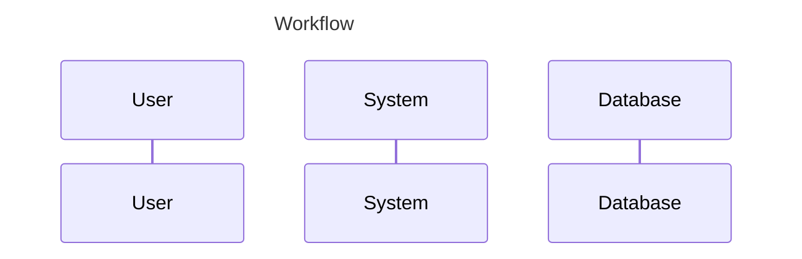

1. 产品经理获取需求，分析需求，生成需求文档；
2. 架构团队获取需求文档，设计输出架构文档；
3. 技术团队获取架构文档和需求文档，输出详细设计文档；
4. 工具链专家生成项目模板；
5. 开发leader生成代码结构和接口，并实现mock；
6. 运行项目测试验证整体架构是否正常；
7. 拆解接口实现和方法，确定方法输入和输出参数；
8. 开发工程师开发接口实现，并测试验证接口是否正常；
9. 测试使用BDD测试，并验证接口是否正常；

